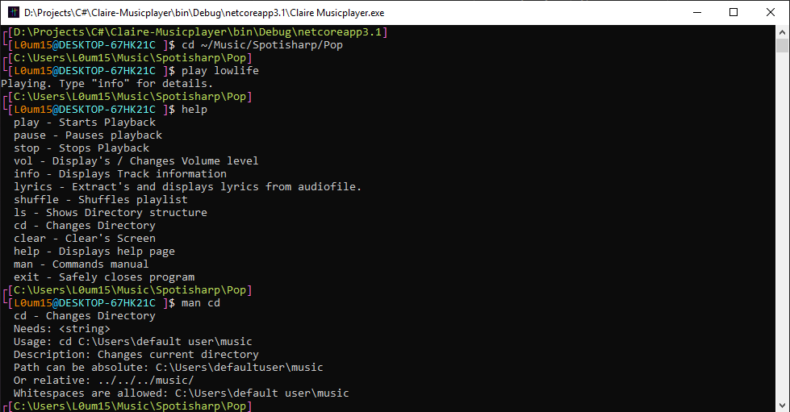
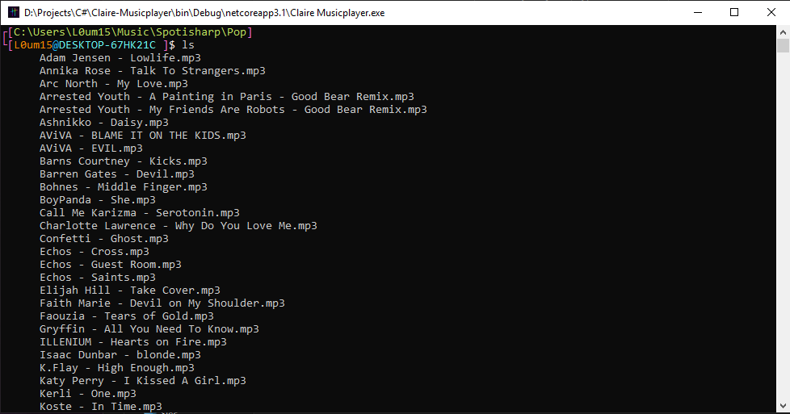
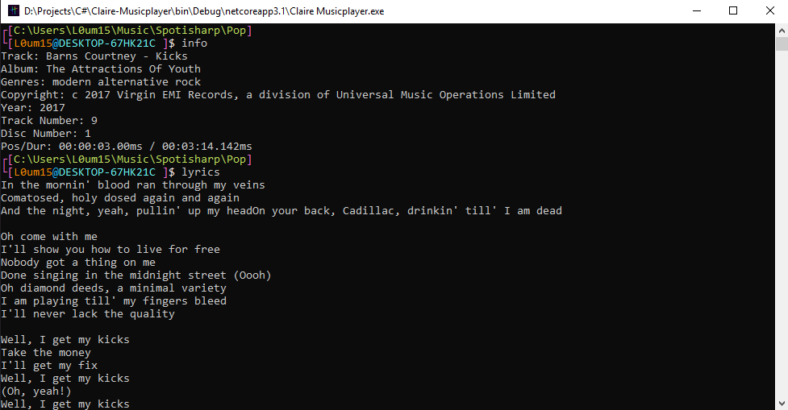

# Claire Musicplayer

## Claire is a Open-Source .NET CLI Musicplayer

*"No fancy gui's, just me and commandline" ~L0um15*

*You can report issues at the issue tracker*

Main goal for Claire is to mimic commandline behaviour as much beginner friendly as possible,
meaning of which: no flags, complicated command syntaxes etc. *(Regex searching will be possible for experienced users and enabled by default)* 

If you want to contribute, here are some things you need to know before commiting changes:
 - *Any disk operations like overwriting files and file deletion are forbidden*
 - *Every command must be isolated. DO NOT execute other commands without user knowledge*

**First alpha build is available now.**

**Gallery** 
*This applies only to latest commit, however difference is minimal compared to released version*

